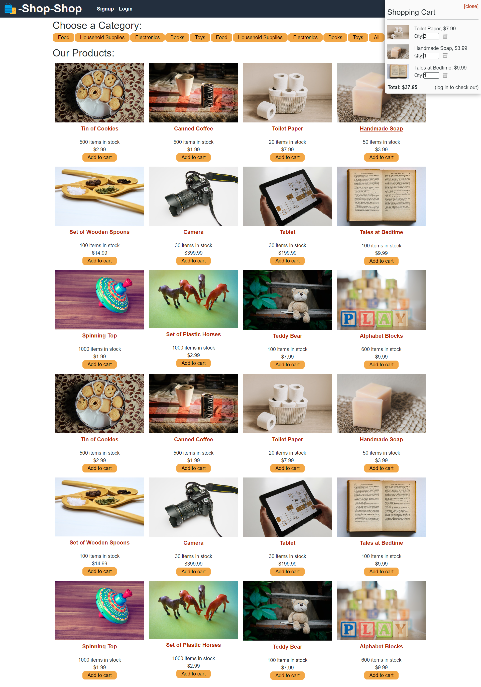

# E-Commerce ( using REDUX )

[](https://opensource.org/license/mit/)

## Description

This is an e-commerce site, that was using the GlobalContext for the state. The goal was to reconfigure it to use REDUX. 

---

## Table Of Contents
                             
- [Description](#description)
- [Installation](#installation)
- [Usage](#usage)
- [License](#license)
- [Questions](#questions)
- [Credits](#credits)

---

## Installation

To install the required dependencies, just run this code: 

```
npm i
```


---

## Usage





---

## License

This Project is licenced under MIT license.

---


## Questions

You can find more about my work at my Github [oliver23n](https://github.com/oliver23n).

## Credits

Starter code was provided by Columbia Coding Bootcamps. I reconfigured it to use REDUX.
